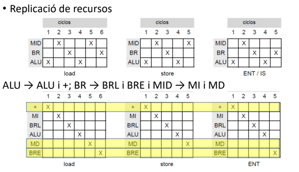
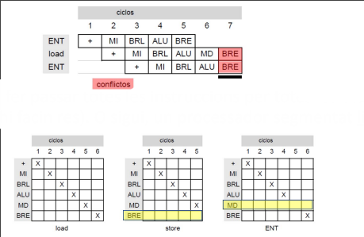

La ejecución de las instrucciones se segmentan en partes comunes.

## Riesgos

### Estructural

Si se reutilizan recursos entre etapas se puede dar el caso de que se intente acceder desde 2 instrucciones diferentes a lo mismo, por lo que lo mejor es no comenzar a ejecutar la segunda instrucción en acceder al dato hasta que no se haya parado de interactuar con este.

#### Latencia de inicio

Los riegos estructurales provocan una latencia de inicio que es el número de ciclo de espera entre el inicio de la ejecución de dos instrucciones.

$$LMI = \frac{\sum^N_{i = 1}(Latencia\_inicio\_instrucción)}{N}$$

---

Para eliminar estos riesgos estructurales se puede añadir hardware, de forma que se dedica un parte del procesador a cada etapa específica.

Aun con esta mejora se pueden provocar riesgos estructurales por dos instrucciones que por el tipo que son acceden de forma diferente al hardware. Esto se puede solucionar forzando a todas las instrucciones a pasar por todas las etapas aunque no les sean necesarias.

## Lógica de control

la detección de riesgos estructurales solo se realiza en la tercera etapa de una instrucción donde se hace la decodificación. Para evitar que se haga realidad este riego se retendrán las instrucciones desde la de esa decodificación y las siguientes un ciclo, inyectando una instrucción NOP en el ciclo actual.

Para reejecutar la etapa tiene un funcionamiento básico con un multiplexor que escoje entre la etapa de la siguiente instrucción o reentrar el dato en el registro de desacople.