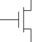
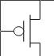

## Condensador

Almacena carga manteniendo el voltaje.

## Resistencia

Puede servir para dividir tensiones.

## Bobina

Mantiene la corriente en un circuito.

## Diodo

Revisar teoría física

### Transistores MOS

Al estar hechos los transistores de materia hay cierta caída de potencial en el transistor a la hora de funcionar el circuito.
#### N-MOS

#### P-MOS

### Transistores BJT

Sirve como amplificador de señal.

### Amplificador operacional

1. La impedancia de entrada es infinita.
2. Cortocircuito virtual entre $Vin_-$ y $Vin_+$ (Realimentación).
3. Ganancia infinita

## Clock

Los relojes de cuarzo tienen cierto error que provoca la necesidad de colocar mecanismos de sincronización entre micros a la hora de trabajar paralelamente.